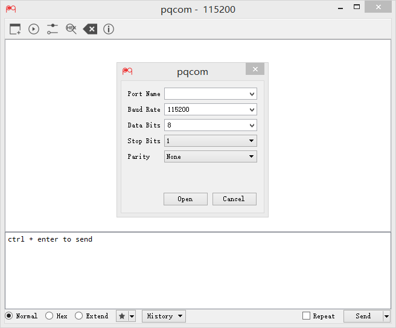

====

A simple serial tool for Linux/Windows/Mac. It's written by Python and Qt (PySide).



### Requirements

-	python
-	pyserial
-	pyside

### Usage

-	Linux/Mac

	```
	pip install pyserial
	pip install pyside
	git clone https://github.com/xiongyihui/pqcom.git
	python pqcom/pqcom.py
	```

-	Windows

	Go to [release channel](https://github.com/xiongyihui/pqcom/releases), download the executable file.
